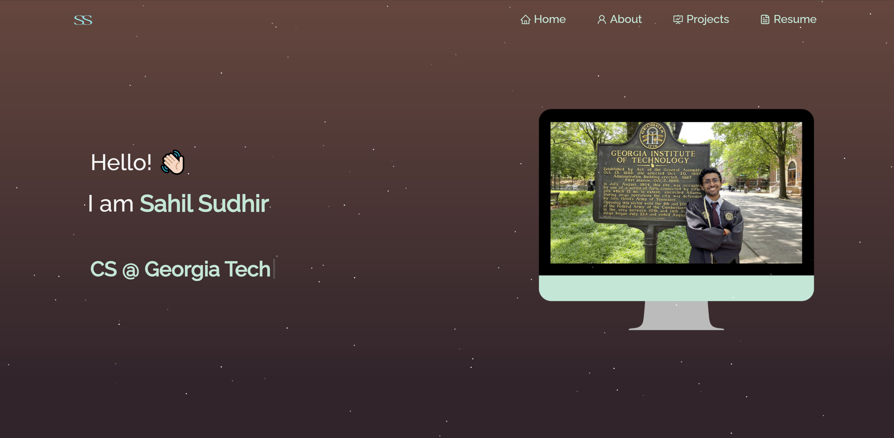

<h2 align="center">
  My Personal Website Version 2.0 
  <a href="https://my.sahilsudhir.app/" target="_blank">sahilsudhir.app</a>
</h2>

  

 

Modified from Soumyajit's Template (https://github.com/soumyajit4419/Portfolio)

## Initial Setup

To clone this repository, you will need `node.js` and `git` installed.

## 🛠 Installation and Setup Instructions

1. Installation: `npm install`

2. In the project directory, you can run: `npm start`

Runs the app in the development mode.\
Open [http://localhost:3000](http://localhost:3000) to view it in the browser.
The page will reload if you make edits.

## Usage Instructions

Open the project folder and Navigate to `/src/components/`.  
You will find all the components used and can edit your info accordingly.

